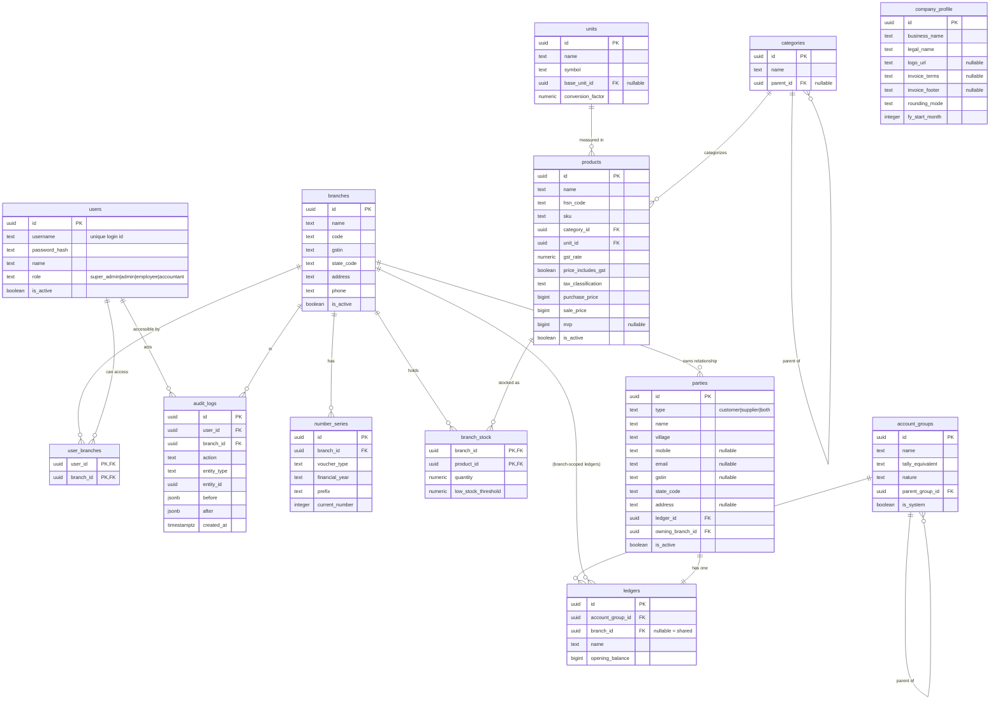

# Fertilizer Shop Management System — Technical Design Document (TDD)

> The engineering companion to the Blueprint. This is the document you (solo dev) open every day to know *how* to build each thing. The Blueprint says *what* and *why*; this says *how*, in build order.

**Status:** Living document, built iteration by iteration.
**Companion to:** `BLUEPRINT.md` (revision 4).

---

## 0. How to read this document & the iteration plan

This doc grows in the same order you'll build. Each iteration is reviewed and locked before the next begins. We do **not** run ahead of what's been reviewed.

| Iteration | Covers | Status |
|---|---|---|
| **1** | Locked stack, repo structure, core conventions, **Phase 0 + Phase 1 data model & schema** (auth, branches, masters) | ✅ locked |
| **2** | Backend architecture: layered pattern, custom auth, auth/permission/branch middleware, audit logging, idempotency, validation, error handling | ✅ locked |
| **DC** | **Data-contract addendum (§18–22):** ledger posting sign convention + posting map, weighted-average costing + cost on stock movements, edit-vs-day-close rule, voucher_date/day boundaries, testing strategy | ✅ locked — binds Iterations 3+ |
| 3 | Transactions: sales/purchases schema + line items, ledger_postings, stock_movements, the atomic Sale/Purchase services, bill edit/cancel, hold/park, last-price recall, printable-invoice payload | planned — next |
| 4 | Payments, ledgers, outstanding, cash reconciliation | planned |
| 5 | Returns, adjustments, contra, journal | planned |
| 6 | Reports & GST exports | planned |
| 7 | Multi-branch consolidation, deployment, Docker, backups | planned |

Whenever a decision now would save a painful migration later, it's called out as a **⚠️ Now-vs-later** note.

---

## 1. Locked Technology Stack

| Layer | Choice | Notes |
|---|---|---|
| Language | **TypeScript** | Strict mode on. Worth it on a solo project of this size. |
| API runtime | **Node.js + Express** | All business logic lives here. |
| Database | **PostgreSQL via Supabase** | Used purely as managed Postgres (+ Storage later). Not used for auth. |
| ORM / migrations | **Prisma + Prisma Migrate** | Type-safe client, mature migrations (mandatory, version-controlled). Needs Supabase pooled + direct URLs (see §1.2). |
| Auth (authentication) | **Custom, in our API** | Admin-provisioned users, password hashing, JWT (access + refresh). No Supabase Auth, no self-signup. |
| Authorization | **Custom, in our API** | 4 global roles + branch access list. |
| File storage | **Supabase Storage** | For invoice PDFs later (optional; the only Supabase feature beyond Postgres we may use). |
| IDs | **UUID v4** (`gen_random_uuid()`) | Friendly to web+mobile and idempotency. |
| Money | **Integer paise, stored as `bigint`** | Never floats. ₹1 = 100 paise. Format to rupees only at display. |
| Quantity | **`numeric(12,3)`** | Supports fractional units (loose kg). |
| Containerization | **None yet** | Develop against a cloud Supabase project. Docker added at deployment. |
| Web client | React | Talks only to our API. |
| Mobile client | *Deferred* | Framework chosen later; does not affect the API. |

### 1.1 How Supabase is used (read this once, internalize it)

Supabase is **just our managed Postgres** (and, later, optional file storage). All identity, authentication, authorization, roles, and branches live in our own backend and our own tables.

```
   Web / Mobile
       │   (only ever talk to OUR API)
       ▼
  Express API   ← authentication (login, password, JWT) AND
  (all logic)     authorization (roles + branches) both here
       │
       ▼
  Supabase Postgres   (our schema, accessed via Prisma, server-side only)
```

- Clients **never** query the Supabase database directly. No client-side `supabase-js` data calls, no PostgREST for business data. The only thing that touches the database is our API, via Prisma.
- **We do our own auth.** Users are created by a Super Admin (no self-signup). We store the password hash, verify credentials on login, and issue our own JWTs (access + refresh). Full design in §7.
- Because we don't use Supabase Auth or PostgREST, we don't need the Supabase anon/service keys for normal operation — Prisma connects with the Postgres connection string. (Supabase Storage, if/when used for invoice PDFs, is the only thing that would need a Supabase key.)

⚠️ **Now-vs-later:** never leak the database connection string or JWT signing secrets to any client. They live only in the API's server environment.

### 1.2 Prisma + Supabase connection setup (the one gotcha)

Supabase exposes **two** connection strings, and Prisma needs both. This is the single thing that trips people up; set it once and forget it.

| Use | Connection | Prisma field | Env var |
|---|---|---|---|
| **App runtime** | Pooled (Supavisor/PgBouncer, port `6543`), append `?pgbouncer=true` | `url` | `DATABASE_URL` |
| **Migrations** | Direct (port `5432`) — migrations can't run through the pooler | `directUrl` | `DIRECT_URL` |

```prisma
datasource db {
  provider  = "postgresql"
  url       = env("DATABASE_URL")   // pooled, ?pgbouncer=true — used by the app
  directUrl = env("DIRECT_URL")     // direct 5432 — used by prisma migrate
}
```

Rule of thumb: **the app uses the pooled URL, migrations use the direct URL.** Both URLs come from the Supabase dashboard (Project → Database → Connection string). Get this right and migrations + runtime both just work.

⚠️ **Now-vs-later:** set both URLs from day one. Running migrations against the pooled URL fails confusingly; wiring `directUrl` now avoids that entirely.

---

## 2. Repository & Project Structure

Three repos (per Blueprint §3.2). This iteration only details the API.

```
api-backend/
├── src/
│   ├── config/          # env loading, constants
│   ├── db/
│   │   └── client.ts            # Prisma client singleton
│   ├── modules/          # feature modules (vertical slices)
│   │   ├── auth/
│   │   ├── branches/
│   │   ├── users/
│   │   ├── products/
│   │   ├── parties/
│   │   └── ...            # sales, purchases... added in later iterations
│   ├── middleware/       # auth, branch-context, error handler, audit
│   ├── shared/           # types, response envelope, errors, utils (money, dates)
│   ├── app.ts            # express app wiring
│   └── server.ts         # entry point
├── prisma/
│   ├── schema.prisma     # Prisma schema (models = tables) — single location
│   └── migrations/        # Prisma Migrate SQL migrations (committed)
├── .env                  # NEVER committed
├── .env.example          # committed
└── package.json
```

**Module shape (vertical slices).** Each feature folder holds its own `routes`, `controller`, `service`, and `validation`. Business logic lives in **services**; controllers only translate HTTP ↔ service calls. (Full layering rules in Iteration 2.)

⚠️ **Now-vs-later:** keep all SQL/data access inside services (or a thin repository layer they call). Never let a controller touch the database directly — it makes transactions and testing painful later.

---

## 3. Core Conventions (apply everywhere, from the first table)

### 3.1 Common columns on every table
Every table carries these, applied uniformly:

| Column | Type | Purpose |
|---|---|---|
| `id` | `uuid` PK, default `gen_random_uuid()` | Primary key. |
| `created_at` | `timestamptz` not null default `now()` | Creation time. |
| `updated_at` | `timestamptz` not null default `now()` | Updated by app/trigger on change. |
| `deleted_at` | `timestamptz` nullable | **Soft delete.** Non-null = deleted. Never hard-delete business data. |
| `created_by` | `uuid` nullable | Who created it (audit). References `users.id` by convention — **no DB-level FK constraint** (see note). |
| `updated_by` | `uuid` nullable | Who last changed it. Same convention, no FK constraint. |

- **`created_by` / `updated_by` are plain `uuid` columns, not foreign keys.** They hold a `users.id` value by convention but carry no FK constraint: declaring real FKs would add a back-relation on `users` for every table in the schema for no query benefit, and these are audit breadcrumbs on rows whose referenced user is never hard-deleted. Referential integrity here is a convention enforced by the service layer, not the database.

- **Soft delete rule:** all reads filter `deleted_at IS NULL` by default. Deleting sets the timestamp.
- For tables below, these common columns are implied and not repeated; only domain columns are listed.

### 3.2 Money
- Stored as **`bigint` paise**. `₹1,250.50` → `125050`.
- All arithmetic in integer paise in the API. Convert to rupees **only** at the display/print boundary.
- Never use `float`/`double` for money, ever.
- **JSON serialization (locked):** Prisma returns `bigint` columns as JS `BigInt`, which `JSON.stringify` throws on. Convention: **serialize paise as a JSON `number`** at the envelope boundary (a shared serializer converts `BigInt → Number`). Safe: `Number.MAX_SAFE_INTEGER` ≈ 9.0×10¹⁵ paise ≈ ₹90 trillion — far beyond shop money. Inputs are validated as integers (§10).

### 3.3 Quantity
- `numeric(12,3)` — supports fractional units (e.g. 12.500 kg). Avoids float drift.

### 3.4 Identifiers & references
- UUID PKs everywhere. Foreign keys named `<entity>_id`.
- All FKs indexed.

### 3.5 API response envelope
Every endpoint returns the same shape so web + mobile parse identically:
```ts
// success
{ "data": <payload>, "meta": { ...pagination etc } | null, "error": null }
// failure
{ "data": null, "meta": null, "error": { "code": "STRING_CODE", "message": "human readable", "details"?: any } }
```

### 3.6 List endpoint conventions
Every list endpoint supports: `branch_id` (where applicable, server-validated), `page` + `limit` (pagination), `search`, and date range filters where relevant.

### 3.7 Naming
- Tables & columns: `snake_case`, tables plural (`products`, `branch_stock`).
- API routes: `/api/v1/<plural-resource>`.
- TypeScript: `camelCase` vars, `PascalCase` types. In Prisma, model fields are `camelCase` and mapped to `snake_case` columns via `@map`/`@@map` (keeps DB tidy and TS idiomatic).

### 3.8 State codes
- GST state codes are the 2-digit numeric codes (e.g. `09` for UP, `24` for Gujarat). Stored as `text` (preserve leading zero), validated against a known list. Used for intra- vs inter-state tax (Blueprint §6.1).

### 3.9 Uniqueness with soft-delete (important)
Because we soft-delete (rows stay with `deleted_at` set), a plain `UNIQUE` constraint would block reusing a value from a deleted row (e.g. recreating a user `ramesh` after the old one was removed). So every "unique" business column uses a **partial unique index** instead:

```sql
CREATE UNIQUE INDEX ux_users_username_active
  ON users (username) WHERE deleted_at IS NULL;
```

Apply this pattern to: `users.username`, `users.email`, `branches.code`, `products.sku` — and any future "unique" field. (In Prisma this is a partial unique index defined in the schema.)

### 3.10 Indexes
Beyond the partial-unique indexes above and all FKs (§3.4), add search/lookup indexes where the UI filters:
- `parties (name, village)` — the primary customer lookup at the counter.
- `products (name)` and `products (hsn_code)` — product search.
- `audit_logs (entity_type, entity_id)` and `(branch_id, created_at)` — trail lookups.
- Transaction-table indexes are defined in Iteration 3 (e.g. the last-price-recall composite from Blueprint §6.14).

### 3.11 GST & money rounding (locked rule)
Applies to every invoice/bill so totals always reconcile with GST returns:
1. **Per line:** compute taxable value, then tax. **Round each line's tax to the paise** (2 decimals). For inclusive-priced lines, back-calculate taxable = rate ÷ (1 + gst_rate), then tax = rate − taxable, rounded to paise.
2. **Split:** CGST and SGST are each **half of the rounded line tax** (intra-state); IGST is the full line tax (inter-state).
3. **Invoice totals:** sum the rounded line values — never re-round the total from raw figures (that's what causes invoice-vs-return mismatches).
4. **Round-off (optional, per `company_profile.rounding_mode`):** if enabled, round the invoice grand total to the nearest rupee and post the difference (a few paise) to a dedicated **Round Off** ledger, so the books stay balanced to the paise.
- All intermediate math stays in integer paise; rounding means rounding to whole paise, never to a float.

---

## 4. Data Model Overview

Phase 0 (foundation) + Phase 1 (masters) entities and how they relate:



---

## 5. Schema — Phase 0 (Foundation)

### 5.1 `users`
The application user — an internal staff account, **created by a Super Admin** (no self-signup). Holds both identity and credentials, since we do our own authentication.

| Column | Type | Constraints | Notes |
|---|---|---|---|
| `id` | uuid | PK, default `gen_random_uuid()` | Our own id. |
| `username` | text | not null, unique | The "user id" used to log in. |
| `password_hash` | text | not null | Argon2id (preferred) or bcrypt hash. **Never** store the plain password. |
| `name` | text | not null | Display name. |
| `role` | text | not null, check in (`super_admin`,`admin`,`employee`,`accountant`) | Global role. See §7.2. |
| `email` | text | nullable, unique (where not null) | Optional, for future password-reset/notifications. |
| `is_active` | boolean | not null default true | Deactivate without deleting (revokes access immediately). |
| `must_change_password` | boolean | not null default true | New users set their own password on first login. |
| `last_login_at` | timestamptz | nullable | For audit/security. |

+ common columns (§3.1).

**Notes**
- Login identity and password live **here**, in our database — there is no external auth provider.
- Passwords are hashed with **Argon2id** (or bcrypt) at creation and on change; we only ever compare hashes.
- Only a Super Admin can create users and set their initial password (§7.3). New users are flagged `must_change_password` so the admin's initial password is replaced on first login.
- Deactivating (`is_active = false`) blocks login immediately; we soft-delete rather than hard-delete for audit history.

⚠️ **Now-vs-later:** `username` is the stable login id. If you later want email-based login too, the optional `email` column is already here — non-breaking.

### 5.2 `branches`
Root of multi-branch (Blueprint §5.1).

| Column | Type | Constraints | Notes |
|---|---|---|---|
| `name` | text | not null | |
| `code` | text | not null, unique | Short code, used in invoice numbering (e.g. `MAIN`, `BR2`). |
| `gstin` | text | nullable | Each branch its own GSTIN. |
| `state_code` | text | not null | 2-digit GST state code; drives intra/inter-state tax. |
| `address` | text | nullable | Printed on invoices. |
| `phone` | text | nullable | |
| `is_active` | boolean | not null default true | |

+ common columns.

### 5.3 `user_branches`
Which branches a user may access. Super admins bypass this (access all).

| Column | Type | Constraints |
|---|---|---|
| `user_id` | uuid | FK → users.id, PK part |
| `branch_id` | uuid | FK → branches.id, PK part |

- Composite PK `(user_id, branch_id)`.
- No common columns needed (pure join); keep `created_at` for traceability.
- **Authorization rule:** a non-super-admin can act only on branches present here. Enforced in middleware (Iteration 2).

### 5.4 `audit_logs` (Blueprint §10.1)
Immutable record of meaningful actions.

| Column | Type | Constraints | Notes |
|---|---|---|---|
| `id` | uuid | PK | |
| `user_id` | uuid | FK → users.id, nullable | Who acted (null for system). |
| `branch_id` | uuid | FK → branches.id, nullable | Context branch. |
| `action` | text | not null | e.g. `create`,`update`,`cancel`,`login`. |
| `entity_type` | text | not null | e.g. `product`,`sale`,`party`. |
| `entity_id` | uuid | nullable | Affected row. |
| `before` | jsonb | nullable | Prior values (for edits). |
| `after` | jsonb | nullable | New values. |
| `created_at` | timestamptz | not null default now() | |

- **Append-only.** No `updated_at`/`deleted_at`; never edited or deleted.
- Index on `(entity_type, entity_id)` and `(branch_id, created_at)`.

**Audit-log strategy**
- **One generic table, same database — not one table per entity.** The generic columns (`entity_type`, `entity_id`, `action`, `before`/`after` jsonb) let this single table record an action on *any* entity regardless of its shape. One row = one logged action.
- **What is logged:** all state-changing actions — transaction create/edit/cancel, master create/edit/deactivate, and user/auth events (user created, role/branch changed, deactivated, login, password reset). **Reads/report-views are NOT logged** (no value, huge volume).
- **Written centrally, inside the same DB transaction as the change** — via one shared audit helper called by the service layer, never scattered `insert` statements. So the change and its audit row commit or roll back together; the trail can't drift from reality.
- ⚠️ **Lean rule (drives storage runway):** for an **edit**, store only the **changed fields** in `before`/`after`; for a **create**, store `after` only (no `before`). Never log reads. This is the main lever that stretches the free-tier storage life (§8.1). Full helper/middleware mechanics in Iteration 2.

### 5.5 `number_series` (Blueprint §10.5)
Per-branch, per-voucher-type, per-financial-year sequential numbering. GST requires unbroken series.

| Column | Type | Constraints | Notes |
|---|---|---|---|
| `id` | uuid | PK | |
| `branch_id` | uuid | FK → branches.id, not null | |
| `voucher_type` | text | not null | `sale`,`purchase`,`receipt`,`payment`,`credit_note`, etc. |
| `financial_year` | text | not null | e.g. `2025-26`. |
| `prefix` | text | nullable | e.g. `INV/MAIN/2025-26/`. |
| `current_number` | integer | not null default 0 | Last issued number. |

- Unique constraint `(branch_id, voucher_type, financial_year)`.
- **Financial year** is derived from the voucher's business date by a shared helper that reads **`company_profile.fy_start_month`** (default 4 = April, i.e. the Indian FY 1 Apr–31 Mar): a date before the start month belongs to the FY that began the previous year (e.g. 15 Feb 2026 → FY `2025-26`). One source of truth — the helper, driven by the setting; never hardcode the boundary elsewhere, and it's not user-entered.
- **Concurrency:** numbers are allocated inside the voucher's DB transaction with a row lock (`SELECT ... FOR UPDATE`) or an atomic increment, so two simultaneous bills never collide. Full mechanism in Iteration 3.

⚠️ **Now-vs-later:** model numbering as its own table now. Deriving invoice numbers by counting rows later is unsafe (gaps/duplicates on cancellation and concurrency).

### 5.6 `company_profile` (business-wide settings)
A **single-row** table holding business-level identity, invoice branding, and global config that isn't per-branch. There's no home for these otherwise, and the printable invoice (Blueprint §9) needs them.

| Column | Type | Constraints | Notes |
|---|---|---|---|
| `id` | uuid | PK | Single row (enforced — see note). |
| `business_name` | text | not null | Trade name shown on invoices. |
| `legal_name` | text | nullable | Registered legal entity name. |
| `logo_url` | text | nullable | Reference to logo (Supabase Storage) for invoices. |
| `invoice_terms` | text | nullable | Standard terms printed on invoices. |
| `invoice_footer` | text | nullable | Footer/notes on invoices. |
| `rounding_mode` | text | not null default `none`, check in (`none`,`nearest_rupee`) | Drives the invoice round-off rule (§3.11). |
| `fy_start_month` | integer | not null default 4 | Financial-year start month (4 = April, Indian FY). |

+ common columns.

**Notes**
- **Enforced single row** (e.g. a fixed known id, or a one-row check). It's global config, not a list.
- Per-branch identity (GSTIN, address, phone) stays on `branches` (§5.2); this table is only the business-wide bits above them.
- Room to grow: as more global preferences appear, add columns here rather than scattering constants in code. Keep it structured (not a loose key-value bag) while the settings are known.

⚠️ **Now-vs-later:** give global settings a home now. Hardcoding business name / rounding / FY-start in code and hunting them down later is exactly the pain this avoids.

---

## 6. Schema — Phase 1 (Masters)

### 6.1 `account_groups` (Blueprint §5.3)
Friendly-named accounting groups mapping to Tally groups.

| Column | Type | Constraints | Notes |
|---|---|---|---|
| `name` | text | not null | Display name, e.g. `Customers / Receivables`. |
| `tally_equivalent` | text | nullable | e.g. `Sundry Debtors`. For reference/reporting. |
| `nature` | text | not null, check in (`asset`,`liability`,`income`,`expense`,`equity`) | Drives P&L vs Balance Sheet placement. |
| `parent_group_id` | uuid | FK → account_groups.id, nullable | Hierarchy. |
| `is_system` | boolean | not null default false | Pre-seeded groups can't be deleted. |

+ common columns.

**Seed set** (created at setup): Customers/Receivables (Sundry Debtors, asset), Suppliers/Payables (Sundry Creditors, liability), Bank Accounts (asset), Cash-in-Hand (asset), Sales Accounts (income), Purchase Accounts (expense), Direct/Indirect Expenses (expense), Direct/Indirect Income (income), Duties & Taxes (liability), Capital (equity), Loans (liability), Fixed Assets (asset).

> **Deferred:** the `nature` enum (`asset/liability/income/expense/equity`) is intentionally coarse for now. Tally splits income/expense into *direct* vs *indirect* to compute gross-vs-net profit on the P&L. If the P&L needs that split, we'll add a `sub_nature` (or use the group hierarchy via `parent_group_id`) in the Reports iteration — a conscious choice, revisited then, not a blocker now.

### 6.2 `ledgers` (Blueprint §5.4)
Every entity money flows to/from. Sits under a group.

| Column | Type | Constraints | Notes |
|---|---|---|---|
| `name` | text | not null | |
| `account_group_id` | uuid | FK → account_groups.id, not null | |
| `branch_id` | uuid | FK → branches.id, **nullable** | Null = shared/global (e.g. Sales, GST). Set = branch-specific (e.g. each branch's Cash). |
| `opening_balance` | bigint | not null default 0 | Paise, signed per the posting contract (**§18.1**: debit balance positive). |

+ common columns.

**Notes**
- **Party ↔ ledger link is one-directional to avoid a circular FK.** The link lives **only** on `parties.ledger_id` (a party has exactly one ledger). The `ledgers` table does **not** carry a `party_id`. To find the party that owns a ledger, query `parties` by `ledger_id` (indexed). This means a ledger can be created first, then the party created referencing it — no chicken-and-egg, no nullable-then-backfill hack.
- Cash and Bank ledgers are branch-scoped (`branch_id` set). Sales, Purchase, GST ledgers are typically shared (`branch_id` null).
- Each customer/supplier auto-gets one ledger. The running balance is **computed from transactions**, not stored as a mutable field — balance = opening_balance + SUM(posting amounts), per the posting contract (**§18.1**). Statement/outstanding features built in Iteration 4.

### 6.3 `units` (Blueprint §5.8)

| Column | Type | Constraints | Notes |
|---|---|---|---|
| `name` | text | not null | e.g. `Kilogram`, `Bag`. |
| `symbol` | text | not null | e.g. `kg`, `bag`. |
| `base_unit_id` | uuid | FK → units.id, nullable | For conversions (e.g. Bag → kg). |
| `conversion_factor` | numeric(12,4) | nullable | e.g. 1 bag = 50.0000 kg. |

+ common columns.

### 6.4 `categories` (Blueprint §5.9)

| Column | Type | Constraints | Notes |
|---|---|---|---|
| `name` | text | not null | e.g. Fertilizer, Pesticide, Seed, Tools. |
| `parent_id` | uuid | FK → categories.id, nullable | Sub-categories. |
| `default_gst_rate` | numeric(5,2) | nullable | **Pre-fill only.** New products in this category default to this rate; always editable per product. |
| `default_tax_classification` | text | nullable, check in (`taxable`,`exempt`,`nil_rated`,`non_gst`) | Pre-fill only, same rule. |

+ common columns.

> **The rate lives on the product; the category only supplies a default.** Exceptions exist inside every category at this shop (chemical pesticide 18% vs neem bio-pesticide 5% in the same "Pesticides" category; branded organic manure 5% vs loose 0% under "Fertilizers"), so category-level rates are a convenience, never the source of truth.

### 6.5 `products` (Blueprint §5.7)

| Column | Type | Constraints | Notes |
|---|---|---|---|
| `name` | text | not null | |
| `hsn_code` | text | nullable | GST HSN. |
| `sku` | text | nullable, unique (where not null) | Internal code. |
| `category_id` | uuid | FK → categories.id, nullable | |
| `unit_id` | uuid | FK → units.id, not null | |
| `gst_rate` | numeric(5,2) | not null default 0 | e.g. 5.00, 18.00. |
| `price_includes_gst` | boolean | not null default false | Default exclusive (Blueprint §5.7/6.1). |
| `tax_classification` | text | not null default `taxable`, check in (`taxable`,`exempt`,`nil_rated`,`non_gst`) | Drives GST reporting. |
| `purchase_price` | bigint | not null default 0 | Paise. |
| `sale_price` | bigint | not null default 0 | Paise. Single price (no price lists). |
| `mrp` | bigint | nullable | Paise. |
| `is_active` | boolean | not null default true | |

+ common columns.

**Notes**
- No batch/expiry (confirmed not needed).
- Low-stock threshold is **per branch**, so it lives in `branch_stock`, not here.

### 6.6 `branch_stock` (Blueprint §5.7 — per-branch stock)
The same product has independent stock per branch.

| Column | Type | Constraints | Notes |
|---|---|---|---|
| `branch_id` | uuid | FK → branches.id, PK part | |
| `product_id` | uuid | FK → products.id, PK part | |
| `quantity` | numeric(12,3) | not null default 0, **CHECK (quantity >= 0)** | Current on-hand. Service enforces the block (Blueprint §6.1); the DB CHECK is defense-in-depth that catches any future bug forever. (Prisma can't declare CHECKs — add via raw SQL in the migration.) |
| `avg_cost` | bigint | not null default 0 | **Weighted-average cost per unit (paise)** at this branch — the costing cache (see §19). Updated inside the same transaction as inbound stock movements. |
| `low_stock_threshold` | numeric(12,3) | nullable | Prompted at product/stock add; drives low-stock alert. |

- Composite PK `(branch_id, product_id)`.
- Keep `updated_at` for "last movement" reference.
- **Stock is mutated only inside transaction services** (sale/purchase/adjustment/transfer), never by direct edits. Detailed in Iteration 3.

⚠️ **Now-vs-later:** stock as a per-(branch,product) row is the single source of truth for "on hand." Don't put a `quantity` column on `products` — that breaks the moment you have two branches.

### 6.7 `parties` (Blueprint §5.5 / §5.6)
Unified customer/supplier model with segregated UI (Blueprint §5.5–5.6).

| Column | Type | Constraints | Notes |
|---|---|---|---|
| `type` | text | not null, check in (`customer`,`supplier`,`both`) | Drives which section(s) it appears in. |
| `name` | text | not null | Primary identifier (with village). |
| `village` | text | not null | Primary identifier. |
| `mobile` | text | nullable | Optional. Phone-as-identity deferred. |
| `email` | text | nullable | Optional. |
| `gstin` | text | nullable | For B2B invoices. |
| `state_code` | text | not null | Defaults to owning branch's state; drives inter-state tax. |
| `address` | text | nullable | |
| `ledger_id` | uuid | FK → ledgers.id, not null | Each party has exactly one ledger. |
| `owning_branch_id` | uuid | FK → branches.id, not null | Which branch "owns" the relationship. |
| `is_active` | boolean | not null default true | |

+ common columns.

**Notes**
- **Opening balance is NOT stored here** — it lives on the party's ledger (`ledgers.opening_balance`), the single source of truth for money. The party row is identity; the ledger holds the balance. This avoids two conflicting copies of the same number.
- No credit limit (confirmed not wanted).
- A `both`-type party shows in both Customer and Supplier sections but has one ledger, so its balance nets correctly (Blueprint discussion).
- **Creation order (atomic, in the party service):** create the ledger first (under Customers/Receivables or Suppliers/Payables), then create the party with `ledger_id` pointing to it. Both happen in one transaction. This works cleanly because the link is one-directional (§6.2) — no circular dependency.

---

## 7. Auth & Authorization Design (custom, in our API)

We do **both** authentication and authorization ourselves. No external auth provider.

### 7.1 Authentication (who you are)
- **Provisioning:** only a **Super Admin** creates users — sets `username` + an initial password and assigns role + branches. No public signup endpoint exists.
- **Password storage:** hashed with **Argon2id** (or bcrypt). Plain passwords are never stored or logged.
- **Login:** `POST /api/v1/auth/login` with username + password → verify hash → on success issue a short-lived **access token (JWT)** and a longer-lived **refresh token**. `must_change_password` users are forced to set a new password before normal access.
- **Tokens:** access token carries `{ userId, role }` (signed with our secret); refresh token rotates to get a new access token. Inactive (`is_active = false`) users are rejected at login and token-refresh.
- (Detailed token lifetimes, refresh rotation, and middleware in Iteration 2.)

### 7.2 Authorization (what you can do) — the four roles
Global roles (no per-branch roles). Scope is controlled by the `user_branches` access list.

| Role | Branch scope | What they can do |
|---|---|---|
| **Super Admin** | All branches | Everything: creates/manages all users (sets ids & passwords), assigns branches, all operations, edit/cancel, consolidated cross-branch views, audit log. |
| **Admin** | Assigned branch(es) | Full operations within their branch(es): billing, purchases, receipts/payments, expenses, **bill edit/cancel**, stock adjustment, cash-close resolution. Cannot manage users. |
| **Employee** | Assigned branch(es) | Day-to-day operations: billing, receipts/payments, expenses, enters cash count. **Cannot** edit/cancel confirmed bills (must escalate) or do stock adjustments. |
| **Accountant** | Assigned branch(es) | **Read-only, reports only.** Sees branch-wise reports and financial/ledger views for assigned branches. No transaction creation, no edits, no operations. |

**Authorization rules:**
- **Super Admin** bypasses the branch list (implicit access to all branches).
- **Admin / Employee / Accountant** can act only on branches present in their `user_branches` rows (assigned by the Super Admin).
- Every request resolves an **acting branch** (from `branch_id` param/header); middleware checks the user's role permits the action *and* the user may access that branch.
- (Per-action enforcement and the permission middleware are detailed in Iteration 2.)

### 7.3 User provisioning flow (Super Admin only)
1. Super Admin calls `POST /api/v1/users` with username, name, role, initial password, and (for non-super-admin roles) the list of assigned branch ids.
2. API hashes the password, creates the `users` row (`must_change_password = true`), and inserts `user_branches` rows.
3. On first login the user is required to set their own password.
4. Super Admin can deactivate (`is_active = false`), reset a password, or change role/branch assignments later. All such actions are audit-logged.

**Password reset model:** admin-reset for now — the Super Admin sets a temporary password and the user changes it on next login (`must_change_password = true`). No email infrastructure required. **Email-based self-service reset is a planned future option** (the optional `email` column already supports it); deferred, not built now.

⚠️ **Now-vs-later:** roles are **global + branch access list**. If a user ever needs a different role per branch, that's a future change (add a `role` column to `user_branches`). Not built now.

### 7.4 Environment secrets (API server only)
`.env` (never committed) holds: **`DATABASE_URL`** (pooled, `?pgbouncer=true`, for the app), **`DIRECT_URL`** (direct 5432, for Prisma migrations), **`JWT_ACCESS_SECRET`** and **`JWT_REFRESH_SECRET`** (for signing our own tokens), and token lifetimes. *(Supabase Storage keys are added only if/when we use Storage for invoice PDFs — not needed for the database.)* `.env.example` documents the keys without values.

---

## 8. What Iteration 1 Locks, and What's Next

**Locked this iteration:** stack (Supabase as managed Postgres only, **Prisma** ORM, **custom auth** in our API), repo structure, conventions (money/qty/ids/soft-delete/envelope), the Phase 0 + Phase 1 schema, the **four-role model** (Super Admin / Admin / Employee / Accountant) with a branch access list, and admin-provisioned users (no self-signup).

### 8.1 Hosting & backups (decided)
- **Host:** Supabase. **Free tier** for development and early production; upgrade to **Pro ($25/mo)** when database storage approaches the 500 MB ceiling.
- **Storage runway:** at ~30 orders/day × 2 shops, expect to approach 500 MB in **roughly 9–14 months**, driven mainly by the audit log. Archiving old audit logs to cold storage can extend this well into a second year before upgrading.
- **Auto-pause:** not a concern for this use case (a daily keep-alive query trivially avoids it if ever needed).
- **Backups (mandatory, our responsibility, and a GO-LIVE PREREQUISITE):** a scheduled job runs `pg_dump` every evening and keeps a **rolling 7-day window** (delete day-8), exported to separate storage. This mirrors Pro's 7-day backup safety net at zero cost and is the real protection for the shop's books. **The cron must be running BEFORE the first real transaction is recorded** — it's a ~20-line script; sequence it with go-live, not with the deployment iteration.
- **Environments:** **two Supabase projects — `dev` and `prod`** (both can start on free tier). Prod secrets live only in the prod host environment; seeds differ (dev gets fixture data, prod gets only the clean seed: account groups, units, Super Admin, company profile).
- **Error monitoring (before first live use, not Iteration 7):** wire **Sentry (free tier)** into the API — uncaught exceptions and failed money-transaction alerts. A crashed sale at the counter must reach you within minutes from day one of live use.
- ⚠️ **Design constraint for Iteration 2:** **keep the audit log lean** (store only changed fields / avoid logging reads) — it's the main driver of storage growth and therefore of how long the free tier lasts.

### 8.2 All Iteration-1 decisions are now locked
Nothing left open — roles (four global roles + branch list), ORM (Prisma), and auth (custom, admin-provisioned) are all decided. Ready for Iteration 2.

**Iteration 2 will cover:** the backend architecture in code terms — the route→controller→service layering; the **custom auth implementation** (Argon2id hashing, login, access/refresh tokens, refresh rotation); the auth/branch-context/permission/audit/error middleware; the idempotency mechanism; validation strategy; the lean audit-log design; and the connection-resilience contract — so that when we hit transactions in Iteration 3, the skeleton is fully specified.

---

# Iteration 2 — Backend Architecture

> How the API is wired: the layers a request flows through, custom auth, the middleware stack, audit logging, idempotency, validation, and error handling. With Iteration 1's schema and this skeleton in place, Iteration 3 (transactions) can focus purely on business logic.

---

## 9. Layered Architecture

Every request flows through the same layers. Each layer has one job; keeping them separate is what makes transactions, testing, and auditing sane.

```
HTTP request
   │
   ▼
[ middleware stack ]   request-id → json parse → CORS → rate-limit
   │                   → authenticate → authorize → branch-context
   │                   → idempotency (writes) → validation
   ▼
controller   thin: reads req, calls one service method, returns its result
   │
   ▼
service      ALL business logic. Owns DB transactions. Calls the audit helper.
   │
   ▼
Prisma       data access only. No business rules here.
   │
   ▼
[ error handler ]   catches anything thrown, maps to the response envelope
```

**Layer responsibilities**

| Layer | Does | Never does |
|---|---|---|
| **Route** | Maps URL+method to controller; attaches the right middleware. | Logic. |
| **Controller** | Translates HTTP ↔ service. Pulls `req.auth`, body, params; calls one service method; shapes the response envelope. | Touch Prisma; contain business rules. |
| **Service** | All business logic. Opens DB transactions. Enforces invariants (stock ≥ 0, etc.). Writes audit rows inside the transaction. | Know about HTTP (no `req`/`res`). |
| **Prisma** | Reads/writes rows. | Decide anything. |

⚠️ **Now-vs-later:** services must be HTTP-agnostic (no `req`/`res`). When the mobile app or a background job needs the same logic, it calls the service directly. Leaking HTTP into services forces duplication later.

---

## 10. Validation Strategy

- **Library: Zod.** Define a schema per endpoint input; validate at the controller boundary *before* the service runs.
- Validation produces a typed, trusted object the service can rely on. Services assume their inputs are already validated.
- Validation failures throw a `ValidationError` (→ 422 via the error handler) with field details.

```ts
// modules/products/product.validation.ts
export const createProductSchema = z.object({
  name: z.string().min(1),
  hsnCode: z.string().optional(),
  unitId: z.string().uuid(),
  gstRate: z.number().min(0).max(28),
  priceIncludesGst: z.boolean().default(false),
  taxClassification: z.enum(['taxable','exempt','nil_rated','non_gst']).default('taxable'),
  salePrice: z.number().int().nonnegative(),   // paise
  purchasePrice: z.number().int().nonnegative(),
});
```

- **Money arrives as integer paise** from clients and is validated as a non-negative integer. **Quantities** as numeric strings/decimals (validate range, precision ≤ 3).

---

## 11. Authentication Implementation (custom)

### 11.1 Password hashing
- **Argon2id** (via the `argon2` package). Hash on user creation and on password change; only ever compare hashes. Never log or store plaintext.

### 11.2 Tokens: short access + rotating refresh
- **Access token** — JWT, short-lived (**15 min**), signed with `JWT_ACCESS_SECRET`. Payload: `{ userId, role }`. Sent on every request as `Authorization: Bearer <token>`. Stateless — verified by signature, no DB hit for the token itself (the user lookup in the auth middleware enforces active status).
- **Refresh token** — opaque random token, long-lived (**e.g. 14 days**), **stored hashed** in `refresh_tokens` and **rotated** on every use. Used only to mint a new access token.

### 11.3 New table — `refresh_tokens`
| Column | Type | Constraints | Notes |
|---|---|---|---|
| `id` | uuid | PK | |
| `user_id` | uuid | FK → users.id, not null | |
| `token_hash` | text | not null | Hash of the refresh token (never store raw). |
| `expires_at` | timestamptz | not null | |
| `revoked_at` | timestamptz | nullable | Set on rotation, logout, or deactivation. |
| `user_agent` | text | nullable | Traceability of the session/device. |
| `rotated_from_id` | uuid | nullable, FK → refresh_tokens.id | Set at creation to the id of the row this one rotated from. Multiple rows may share the same `rotated_from_id` (concurrent grace-window rotations off the same parent, see §11.4) — it's a lineage/forensics pointer, not a uniqueness constraint. |
| `created_at` | timestamptz | not null default now() | |

- Index `(user_id)`, `(token_hash)`, and `(rotated_from_id)`.

### 11.4 Flows
- **Login** `POST /auth/login` `{ username, password }` → verify hash → if `must_change_password`, respond with a "must change password" state (limited token) → else issue access + refresh, write the refresh row, set `last_login_at`.
- **Refresh** `POST /auth/refresh` `{ refreshToken }` → look up by hash → if valid, unexpired, not revoked, and user still active: **revoke the old row, issue a new pair** (rotation; the new row's `rotated_from_id` points at the old row), return them.
  **Grace window (30s), corrected:** raw refresh tokens are never stored (only their hash, above) — so a retry can never literally be handed back the exact same raw token another request already received; that value only ever existed in the first response. Instead: if the presented token's row is **already revoked** and that revocation happened **less than 30 seconds ago**, treat it as a legitimate concurrent rotation (e.g. two open tabs racing), not theft — mint the requester their **own** independent new pair (also pointing `rotated_from_id` at the same old row) and do **not** revoke any sibling pair already issued off that row. Both callers end up with their own valid pair; neither breaks the other.
  **Reuse ≥30 seconds** after revocation → theft detection: **revoke every refresh token belonging to that user** (same blast radius as change-password's revoke-all below, not just the one lineage — a suspected-compromised session shouldn't leave other sessions on trust).
- **Change password** `POST /auth/change-password` → verify current (or the must-change token), hash new, set `must_change_password = false`, **revoke all** the user's refresh tokens (force re-login elsewhere).
- **Logout** `POST /auth/logout` → revoke the presented refresh token.
- **Deactivation** (admin) → set `is_active = false` and revoke all the user's refresh tokens. Their access token dies within 15 min; refresh is dead immediately.

⚠️ **Now-vs-later:** storing refresh tokens (vs fully stateless JWT refresh) is what lets a Super Admin instantly cut off a user. For an internal business app that control is worth the one extra table.

---

## 12. Authorization & Branch Isolation (middleware)

Three small middlewares run in order on protected routes: **authenticate → authorize → branch-context.**

### 12.1 `authenticate` — who are you
```ts
export async function authenticate(req, _res, next) {
  const token = bearer(req);                       // throws 401 if missing
  const { userId, role } = verifyAccessToken(token); // throws 401 if bad/expired
  const user = await prisma.user.findFirst({
    where: { id: userId, deletedAt: null },
  });
  if (!user || !user.isActive) throw new UnauthorizedError('USER_INACTIVE');
  req.auth = { userId: user.id, role: user.role };
  next();
}
```

### 12.2 `authorize` — are you allowed this action
A central **capability map** ties each action to the roles allowed, so permissions live in one readable place (mirrors Blueprint §4 + the four-role table §7.2):

```ts
const CAN: Record<string, Role[]> = {
  'product:write'      : ['super_admin','admin'],
  'sale:create'        : ['super_admin','admin','employee'],
  'sale:editCancel'    : ['super_admin','admin'],
  'stock:adjust'       : ['super_admin','admin'],
  'report:view'        : ['super_admin','admin','employee','accountant'],
  'user:manage'        : ['super_admin'],
  // ...
};
export const requireCap = (cap: string) =>
  (req, _res, next) => {
    if (!CAN[cap].includes(req.auth.role)) throw new ForbiddenError('INSUFFICIENT_ROLE');
    next();
  };
```

### 12.3 `branchContext` — which branch, and may you touch it
```ts
export async function branchContext(req, _res, next) {
  const branchId = req.header('x-branch-id') ?? req.body.branchId ?? req.query.branch_id;
  if (!branchId) throw new BadRequestError('BRANCH_REQUIRED');
  if (req.auth.role !== 'super_admin') {
    const ok = await prisma.userBranch.findUnique({
      where: { userId_branchId: { userId: req.auth.userId, branchId } },
    });
    if (!ok) throw new ForbiddenError('BRANCH_NOT_ALLOWED');
  }
  req.auth.branchId = branchId;   // services read context from here
  next();
}
```

- **Super Admin** skips the branch-membership check (sees all).
- Every service receives `ctx = { userId, role, branchId }` and scopes its queries by `branchId`. **Branch isolation is enforced server-side on every request — never trusted from the client.**
- **Accountant** passes `authenticate` + `branchContext` but the capability map limits them to `report:view`, so they can read reports for their assigned branches and nothing else.

---

## 13. Audit Logging (mechanics)

Implements the strategy from §5.4. One shared helper, always called **inside the service's DB transaction**.

```ts
// shared/audit.ts
export async function writeAudit(tx: Tx, ctx: Ctx, e: {
  action: 'create'|'update'|'cancel'|'login'|'deactivate'|...,
  entityType: string,
  entityId?: string,
  before?: object,
  after?: object,
}) {
  const { before, after } = leanDiff(e.before, e.after); // changed-fields only on update
  await tx.auditLog.create({
    data: {
      userId: ctx.userId, branchId: ctx.branchId,
      action: e.action, entityType: e.entityType, entityId: e.entityId,
      before, after,
    },
  });
}
```

- **`leanDiff`**: for an update, keep only keys whose value changed; for a create, `before = null` and `after = the row`; never log reads. **Exception for immutable transaction entities** (sales, purchases, payments, postings): storing the full `after` blob duplicates the row itself, which already can't change silently. For creates of these, log **reference-only** — entity id + a one-line summary (e.g. voucher number, party, total). Full snapshots are reserved for *edits/cancels*, where before/after genuinely differ. This is the biggest storage lever after the changed-fields rule (§8.1).
- Because `writeAudit(tx, ...)` uses the *same* transaction handle as the change, the change and its audit row commit or roll back together — the trail can never drift.
- Auth events (login, password reset, deactivate) are logged from the auth service the same way.

---

## 14. Idempotency

Protects every state-changing (POST/PUT/PATCH) endpoint so a network retry or double-tap can't create duplicates (Blueprint §10.9). Foundational for safe retries under the connection-resilience contract (§16).

### 14.1 New table — `idempotency_keys`
| Column | Type | Constraints | Notes |
|---|---|---|---|
| `key` | text | PK | Client-generated UUID (one per intended action). |
| `user_id` | uuid | FK → users.id, not null | Who issued it. |
| `scope` | text | not null | e.g. `sale:create` — guards against cross-endpoint reuse. |
| `request_hash` | text | not null | Hash of the request body; detects a reused key with different data. |
| `status` | text | not null | `in_progress` \| `completed`. |
| `response` | jsonb | nullable | Stored success response to replay. |
| `created_at` | timestamptz | not null default now() | |
| `expires_at` | timestamptz | not null | Prune after, e.g., 48h. |

### 14.2 Mechanism
1. Write endpoints require an `Idempotency-Key` header (a UUID the client generates once per action and reuses on retries).
2. On arrival: try to **insert** the key as `in_progress` (atomic). 
   - **Insert succeeds** → first time: process normally. **The flip to `completed` (with the stored response) executes INSIDE the same DB transaction as the business write** — never after it. If they were separate, a crash between commit and flip would leave a committed bill behind an `in_progress` key, and the stale takeover would reprocess it: a double bill. Inside one transaction, key-state and business-state can never disagree. (The stored `response` can be minimal — the created voucher id — and reconstructed on replay.)
   - **Insert conflicts** → seen before:
     - `completed` → **replay the stored response** (no reprocessing).
     - `in_progress` **and fresh** (< 60s old) → a retry arrived mid-flight → return `409 IN_PROGRESS`; client retries shortly.
     - `in_progress` **and stale** (≥ 60s old) → the original attempt is presumed dead (server crash mid-processing) → **take over**: delete the stale row, re-insert, process normally. **This is safe only because of a paired guarantee: a statement/transaction timeout (~10s) on the API's DB connections ensures no transaction can still be alive at 60s** — takeover-while-still-running is impossible by construction.
   - If the same key arrives with a **different `request_hash`** → `422` (programming/client error).
3. **Failure path (critical):** if processing throws a handled error *after* the key was inserted, the key row is **deleted in the error path** (try/catch–finally around the service call) — so the operator can fix the input and retry with the same key. A key must never be left `in_progress` by a failed request; only a crash can do that, and the staleness takeover (above) covers it.
4. Keys expire and are pruned after a short window (they only guard against near-term retries).

⚠️ **Now-vs-later:** wire idempotency into the generic write path now, before any transaction endpoints exist. Then every Iteration-3 endpoint inherits safe-retry for free.

---

## 15. Error Handling

### 15.1 Error classes
A small hierarchy; services/middleware `throw`, the central handler formats.

```ts
class AppError extends Error {
  constructor(public code: string, message: string,
              public status: number, public details?: unknown) { super(message); }
}
class ValidationError  extends AppError { constructor(d?){ super('VALIDATION', 'Invalid input', 422, d); } }
class UnauthorizedError extends AppError { constructor(c='UNAUTHORIZED'){ super(c, 'Unauthorized', 401); } }
class ForbiddenError    extends AppError { constructor(c='FORBIDDEN'){ super(c, 'Forbidden', 403); } }
class NotFoundError     extends AppError { constructor(c='NOT_FOUND'){ super(c, 'Not found', 404); } }
class ConflictError     extends AppError { constructor(c){ super(c, 'Conflict', 409); } }
class BadRequestError   extends AppError { constructor(c){ super(c, 'Bad request', 400); } }
// domain-specific, thrown by services:
class InsufficientStockError extends AppError { constructor(d){ super('INSUFFICIENT_STOCK','Not enough stock',409,d); } }
```

### 15.2 Central handler (last middleware)
```ts
export function errorHandler(err, _req, res, _next) {
  if (err instanceof AppError) {
    return res.status(err.status).json({
      data: null, meta: null,
      error: { code: err.code, message: err.message, details: err.details },
    });
  }
  logger.error(err);                       // unknown → log, don't leak internals
  return res.status(500).json({
    data: null, meta: null,
    error: { code: 'INTERNAL', message: 'Something went wrong' },
  });
}
```

- Every error becomes the standard envelope (§3.5) with a stable `code` the clients can switch on (e.g. show "Not enough stock" for `INSUFFICIENT_STOCK`).
- Stable error codes are part of the API contract — clients (web + mobile) branch on `code`, never on message text.

---

## 16. Connection-Resilience Contract (server side)

The server-side half of Blueprint §10.10 (clients don't lose data on a blip; the server makes retries safe).

- **All writes are idempotent** (§14): the client may safely resend a failed request with the same `Idempotency-Key`; the server either completes it once or replays the stored result.
- **All multi-step writes are atomic** (one DB transaction): a dropped connection mid-write leaves no half-applied state — it either fully committed or fully rolled back.
- **Reads are safe to retry** (no side effects).
- Together these let a client retry confidently after a power flicker or wifi drop without creating duplicate bills or corrupt state. No server-side session state is assumed.

---

## 17. What Iteration 2 Locks, and What's Next

**Locked this iteration:** the layered request lifecycle; custom auth (Argon2id, access+refresh with rotation, the `refresh_tokens` table, all auth flows); the authenticate/authorize(capability map)/branch-context middleware and server-side branch isolation; the in-transaction audit helper with lean diffing; the idempotency mechanism and `idempotency_keys` table; the validation strategy (Zod at the boundary); and the error hierarchy + central handler + stable error codes.

**Schema added this iteration:** `refresh_tokens` (§11.3), `idempotency_keys` (§14.1).

**Iteration 3 will cover:** the **transactions schema** (sales, purchases, their line items with the Blueprint §6.14 columns, payments, ledger postings) and the **atomic Sale/Purchase service** — stock check + decrement, ledger postings, payment split, invoice-number allocation, and the audit row, all in one transaction — which is where every piece of this skeleton (transactions, idempotency, audit, branch context, error types) finally comes together.

### 17.1 Carried into Iteration 3 (design notes to resolve there)
These were raised in review and deferred to the transactions iteration by design:
1. **Stock decrement must be row-locked.** The negative-stock hard-block (Blueprint §6.1) is only safe if the read + decrement of the `branch_stock` row happens under `SELECT ... FOR UPDATE` inside the sale transaction. Otherwise two simultaneous sales of the last unit could both pass the check and oversell. Specify the locking explicitly in the atomic Sale service.
2. **"Both"-type party ledger group.** A party who is both customer and supplier has one ledger under one group. Default it to Customers/Receivables (like Tally) and let the balance net; confirm when modelling party ledgers.
3. **Opening balance lives on the ledger only** (fixed in §6.7) — carry this through when designing ledger postings and balance computation.
4. **GST rounding rule (§3.11)** governs all invoice/bill tax math — apply it in the Sale/Purchase services.

---

# Pre-Iteration-3 Addendum — Cross-Iteration Data Contracts

> **Why this exists:** the iterate-as-we-go methodology has one exception — anything that defines the *shape of stored financial data* must be locked before the first row is written, even if the feature that uses it comes later. Iteration 3 writes ledger postings and stock movements; their contracts are defined **here, now**, so Iteration 4+ formalizes nothing retroactively and no financial data ever needs migrating to a new convention.

---

## 18. Ledger Posting Contract (sign convention + posting map)

### 18.1 Representation: signed amount
Every money movement writes rows into `ledger_postings` (table fully defined in Iteration 3; its **contract** is fixed here):

- Each posting row has a **signed `amount` (bigint paise)**: **positive = debit, negative = credit.**
- **A ledger's balance = `opening_balance` + SUM(amount)** of its postings. Nothing else. (Opening balance uses the same convention: debit balance positive — e.g. a customer who owes us has a positive balance on their ledger.)
- **Double-entry invariant:** the postings of any single voucher **must sum to exactly zero**. Enforced in the service on every write (and re-checkable at any time as an integrity audit).
- **Display sign by ledger nature:** asset/expense ledgers display their (debit-positive) balance as-is; liability/income/equity ledgers flip the sign for display (a credit balance shows positive). Storage never flips — only presentation.

### 18.2 Every posting carries `branch_id` (non-negotiable)
`ledger_postings.branch_id` is **NOT NULL** and is always **the branch of the source voucher** — even when the ledger itself is shared (`ledgers.branch_id` null, e.g. Sales, GST). This is what makes **per-branch GSTIN filing** and per-branch P&L work off shared ledgers: GSTR-1/3B for a branch = postings to GST ledgers filtered by the posting's `branch_id`. Without this, shared GST ledgers and per-GSTIN returns are irreconcilable.

Each posting also carries: `ledger_id`, `voucher_type`, `voucher_id` (source document), `voucher_date` (§21), and `created_at`.

### 18.3 Posting map per voucher type
(Dr = positive, Cr = negative. All amounts follow the §3.11 rounding rule.)

| Voucher | Postings |
|---|---|
| **Sale** (intra-state) | Dr Cash/Bank (paid portion) · Dr Customer ledger (udhar portion) · Cr Sales · Cr CGST output · Cr SGST output |
| **Sale** (inter-state) | same, but Cr IGST output instead of CGST+SGST |
| **Purchase** | Dr Purchases · Dr GST input (CGST+SGST or IGST) · Cr Cash/Bank (paid) · Cr Supplier ledger (unpaid) |
| **Receipt** (collect udhar) | Dr Cash/Bank · Cr Customer ledger |
| **Payment** (pay supplier / expense) | Dr Supplier ledger *or* Dr Expense ledger · Cr Cash/Bank |
| **Contra** | Dr destination (Bank/Cash) · Cr source (Cash/Bank) |
| **Credit Note** (sales return) | exact reverse of the sale's postings for the returned lines |
| **Debit Note** (purchase return) | exact reverse of the purchase's postings for the returned lines |
| **Journal** | user-entered Dr/Cr lines (must sum to zero) |
| **Stock Adjustment** (write-down) | Dr Stock Loss/Adjustment ledger · **Cr Purchases** — the written-off goods are removed from the purchases cost pool, valued per §19 |
| **Round-off** (if enabled) | the ± few paise difference posts to the **Round Off** ledger so every voucher still sums to zero |

**Worked example** — intra-state sale ₹1,000 + 5% GST = ₹1,050; customer pays ₹500 cash, ₹550 udhar:
`+50000 Cash · +55000 Customer · −100000 Sales · −2500 CGST · −2500 SGST` → sum = 0 ✓

### 18.4 Inventory accounting model (locked: Tally-style, NOT perpetual ledger inventory)
**Inventory is never a ledger-tracked asset.** Stock quantity and value live *only* in `stock_movements` / `branch_stock` (the §19 valuation engine); there is **no Inventory/Stock ledger** in the chart of accounts, and no posting ever debits or credits one.
- Purchases post to the **Purchases** expense ledger (as in §18.3) — the periodic model.
- Sales post revenue only — **no Dr COGS · Cr Inventory posting per sale.**
- Stock write-offs post **Dr Stock Loss · Cr Purchases** (removing the written-off goods from the purchases cost pool), so the Stock Loss ledger is genuinely balanced by something — it never one-sidedly drifts.
- The eventual **P&L (Iteration 6) is periodic:** Sales − (opening stock + purchases − closing stock) ± write-offs, where the opening/closing stock figures come from the §19 valuation engine — this is exactly how Tally computes it.
- The Σ-of-sale-movement COGS (§19.3) is the **valuation engine's per-sale cost figure** — used for margin analytics and as a cross-check on the periodic P&L, never *added on top of* Purchases in the same statement (that would double-count cost of goods).

---

## 19. Inventory Costing Contract (weighted average)

### 19.1 Method: per-branch weighted average cost
**Locked: weighted average cost, maintained per `(branch, product)`.** (FIFO layers are needless complexity for a fertilizer shop; last-purchase-price misstates COGS. Weighted average is simple, stable, and what the P&L and Stock Valuation reports will use.)

- The current average lives in **`branch_stock.avg_cost`** (bigint paise per unit — §6.6), updated **inside the same transaction** as any inbound movement.
- **Inbound update formula:** `new_avg = (old_qty × old_avg + in_qty × in_rate) / (old_qty + in_qty)`, rounded to the paise. (If `old_qty` = 0, `new_avg = in_rate`.)

### 19.2 `stock_movements` carries cost — contract
Every `stock_movements` row (table defined in Iteration 3) carries, in addition to (product, branch, ±qty, reason, source doc):
- **`rate`** — bigint paise per unit at which this movement is valued
- **`value`** — bigint paise, `rate × qty` rounded to the paise

Without cost on movements, weighted-average/COGS could never be recomputed or audited later. This is the schema decision that had to happen before the first movement row.

### 19.3 Valuation rules per movement type
| Movement | Valued at (`rate`) | Effect on `avg_cost` |
|---|---|---|
| **Purchase (in)** | net purchase cost per unit from the line | recompute (§19.1) |
| **Sale (out)** | current `avg_cost` at that branch — this **is** COGS (never the sale price) | unchanged |
| **Sales return (in)** | the `rate` of the original outbound movement (linked via the credit note → original invoice); fallback: current `avg_cost` | recompute |
| **Purchase return (out)** | current `avg_cost` | unchanged |
| **Adjustment down** (damage/theft/…) | current `avg_cost` — this value posts to the Stock Loss ledger (§18.3) | unchanged |
| **Adjustment up** (count correction) | current `avg_cost` (or an explicitly entered cost if genuinely known) | recompute if entered cost differs |
| **Transfer out** (source branch) | source branch's current `avg_cost` | unchanged at source |
| **Transfer in** (destination branch) | the transfer-out `rate` | recompute at destination |

- **Stock Valuation report** = Σ (`branch_stock.quantity × avg_cost`) — and is always re-derivable from movements as a cross-check.
- **Per-sale COGS** = the sale-outbound movement's `value` — the valuation engine's cost figure, used for margin analytics and to cross-check the periodic P&L (**§18.4**: the ledger P&L itself is periodic — Sales − (opening + purchases − closing) ± write-offs — never movement-COGS *plus* Purchases together).

---

## 20. Bill Edit vs Day-Close Interaction (locked rule)

The gap: day-close (§10.11 Blueprint) locks in a day's cash record; bill edit/cancel (§6.11 Blueprint) reverses cash postings. Editing yesterday's cash bill after yesterday closed would silently falsify the closed reconciliation. The rule:

1. **A bill whose `voucher_date` falls on or before the branch's last closed day cannot be edited or cancelled directly.** The edit service checks this before anything else.
2. **Preferred correction path: a Credit Note dated today** (or a new bill dated today) — the closed day stays intact; today's books carry the correction. This is also the GST-clean approach.
3. **Escalation path: an Admin/Super Admin may explicitly REOPEN a day-close** (a dedicated, audit-logged action with a mandatory reason). While reopened, bills of that day can be edited; the day must then be **re-closed**, which recomputes expected cash and records the new short/over. The audit log holds both closes.
4. **GST-filed periods: credit-note path only** — no reopening a day inside a period whose GSTR has been filed (Blueprint §6.11 guardrail becomes mandatory here).

This constrains the Iteration-3 edit service (check #1 is part of its contract) and the Iteration-4 day-close design (reopen/re-close states).

---

## 21. Voucher Date & Day Boundaries

- Every transaction has a **`voucher_date` of SQL type `date`** — a **user-entered business date** (defaulting to "today"), separate from `created_at` (timestamptz, machine time, audit-only).
- **Day Book, day-close, number-series FY derivation, and all report date filters operate on `voucher_date`** — never on `created_at`.
- The **"today" default is computed in IST (Asia/Kolkata)** — the business's timezone — so a bill entered at 11:58 PM lands on the correct business day regardless of server timezone. This is deliberately narrow: one `date` column + one default-computation rule; no app-wide timezone framework.
- FY derivation (§5.5) reads `voucher_date` through the `fy_start_month` helper.

---

## 22. Testing, Contracts & Build Notes

### 22.1 Testing strategy (minimum bar for financial software)
- **Service-layer tests for every money-touching service** (sale create, edit/cancel, purchase, payments, postings) against a **real test database** (a dedicated schema or the dev Supabase project) — not mocks; the transactions and locks are the thing under test.
- **Golden invoice-math suite:** a fixed set of input→expected-output cases covering: exclusive & inclusive GST, mixed tax classifications on one bill, free/scheme qty, discount toggle, CGST/SGST vs IGST by state, partial payment splits, and the §3.11 rounding edge cases (odd paise, round-off ledger). The rounding rule is exactly the kind of thing that regresses silently — these cases run on every change.
- **Double-entry invariant check** (postings sum to zero) asserted in every transaction test.
- Definition of done for a phase includes these tests passing (see Roadmap §2).

### 22.2 API contract artifact
The Zod schemas (§10) are the single source of truth for request/response shapes. **Export their inferred TypeScript types from a shared package** (or generate OpenAPI from them) so web — and later mobile — consume the exact same contract. Decide the package mechanics before the web frontend starts; never hand-duplicate types in a client.

### 22.3 Prisma build notes (so Iteration 3 doesn't stall)
- **`SELECT ... FOR UPDATE` is not expressible in the Prisma query API.** The stock-row lock and number-series lock are done with **`$queryRaw` inside `prisma.$transaction`**. Pattern: `await tx.$queryRaw\`SELECT ... FROM branch_stock WHERE ... FOR UPDATE\`` then proceed with normal Prisma calls on the same `tx`. **The `branch_stock` lock applies to EVERY movement type, not just sales:** inbound movements (purchase, transfer-in, sales return) do a read-modify-write on the same row for the §19.1 avg-cost recompute, so the purchase/transfer/return services take the identical lock — skipping it there corrupts `avg_cost` under concurrency just as surely as overselling.
- **CHECK constraints** (e.g. `branch_stock.quantity >= 0`, §6.6) aren't declarable in the Prisma schema — add them via raw SQL in a migration file.

---

## 23. GST Compliance Contract (researched July 2026 — binds the invoice layer)

### 23.1 Document-type rule (derived, never user-chosen)
The printable document's legal title is computed from the bill's line classifications + the buyer's registration status (full rule in Blueprint §9):

| Lines on the bill | Buyer | Document |
|---|---|---|
| All `taxable` | any | **Tax Invoice** |
| All `exempt`/`nil_rated` | any | **Bill of Supply** (no tax columns, no tax collected) |
| Mixed | unregistered (no GSTIN) | **Invoice-cum-Bill of Supply** — single document |
| Mixed | registered (GSTIN) | Tax Invoice for taxable lines; exempt lines strictly on a separate Bill of Supply (rare case — split the documents) |

The per-line `tax_classification` (§6.14) already carries everything needed; this is a titling/layout rule in the invoice payload, not new data. The everyday seeds+fertilizer bill to a farmer is the Invoice-cum-Bill-of-Supply case.

### 23.2 Rates are data, not code
- Current landscape (GST 2.0, effective 22 Sep 2025, two slabs): fertilizers **5%** (HSN 3102–3105), unbranded organic manure/bio-fertilizer **0%** (HSN 3101; branded → 5%), chemical pesticides/fungicides/herbicides **18%** (HSN 3808), specified bio-pesticides **5%**, FCO-listed micronutrients **5%**, seeds **0% exempt**, sprayers/farm tools **5%**. So this shop needs only **0 / 5 / 18** today.
- **Never hardcode the slab set** (no enum of rates): rates changed in Sept 2025 and will change again. `gst_rate` is a free numeric on the product; the per-line snapshot (§6.14) keeps historical bills correct through any future change. Category defaults (§6.4) are pre-fill convenience only.
- The 5% fertilizer rate applies to goods *intended for use as fertilizer* — misclassified items attract 18%; classification is the shop's responsibility, the system just stores what's set.

### 23.3 HSN discipline
- **Store the full 6-digit HSN on every product** regardless of turnover; **print at least 4 digits** on invoices. (Current rule: ≤ ₹5 crore AATO → 4-digit HSN mandatory on B2B invoices, optional B2C; > ₹5 crore → 6-digit everywhere. Storing 6 now means never revisiting.) GSTN validates HSN codes at return filing since April 2025, so garbage HSNs surface as filing errors.

### 23.4 Turnover & threshold notes
- **Exempt sales count toward aggregate turnover** (registration, HSN-digit, and e-invoice thresholds) — seed sales are turnover even at 0% tax. Reports must expose the taxable-vs-exempt outward split (the §6.14 classification bucketing already provides it); the accountant uses it for the GSTR-3B proportional ITC reversal on exempt supplies (Rule 42) — the system only supplies the split, never computes the reversal.
- **E-invoicing (IRN/QR)** becomes mandatory above ₹5 crore AATO — not applicable at this shop's scale; a future feature triggered by growth, not a launch requirement.
- Gujarat's GST state code is **24** (GSTIN starts with 24) — the value for `branches.state_code`. (RTO codes like "GJ-16" are vehicle registration districts, unrelated to GST.)
